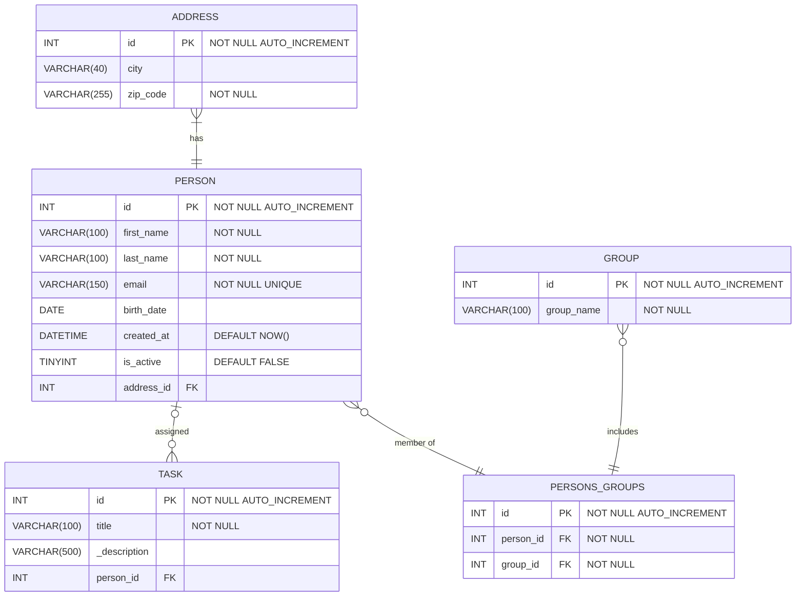

## UML ERD - Entity Relationship Diagram


#### Explanation of the ER Diagram:
- Address table has a one-to-many relationship with the Person table.   
  (each person has one address).
  
- Person has a one-to-many relationship with the Task table.   
  (a person can be assigned multiple tasks).
  
- Person has a many-to-many relationship with Group table.   
  (Many people can be part of many courses)   
  *Actually it's not implemented like this.*

  Person and Group are connected through the 
  `persons_groups` junction table establishing two one-to-many relationships between them.   
  (a person is member of many courses)   
  (a group includes many people)   
  
---
### ER Diagram
*made with an alternative creation method (mermaid)*


#### SQL for creating tables
```sql
CREATE TABLE address (
    id INT PRIMARY KEY NOT NULL AUTO_INCREMENT,
    city VARCHAR(40),
    zip_code VARCHAR(255) NOT NULL
);

CREATE TABLE person (
    id INT NOT NULL PRIMARY KEY AUTO_INCREMENT,
    first_name VARCHAR(100) NOT NULL,
    last_name VARCHAR(100) NOT NULL,
    email VARCHAR(150) NOT NULL UNIQUE,
    birth_date DATE,
    created_at DATETIME DEFAULT NOW(),
    is_active TINYINT DEFAULT FALSE,
    address_id INT NOT NULL UNIQUE,
    FOREIGN KEY (address_id) REFERENCES address(id)
);

CREATE TABLE task (
    id INT NOT NULL PRIMARY KEY AUTO_INCREMENT,
    title VARCHAR(100) NOT NULL,
    _description VARCHAR(500),
    person_id INT,
    FOREIGN KEY (person_id) REFERENCES person(id)
);

CREATE TABLE _group (
    id INT NOT NULL PRIMARY KEY AUTO_INCREMENT,
    group_name VARCHAR(100) NOT NULL
);

CREATE TABLE persons_groups (
    id INT NOT NULL PRIMARY KEY AUTO_INCREMENT,
    person_id INT NOT NULL,
    group_id INT NOT NULL,
    FOREIGN KEY (person_id) REFERENCES person(id),
    FOREIGN KEY (group_id) REFERENCES _group(id)
);
```